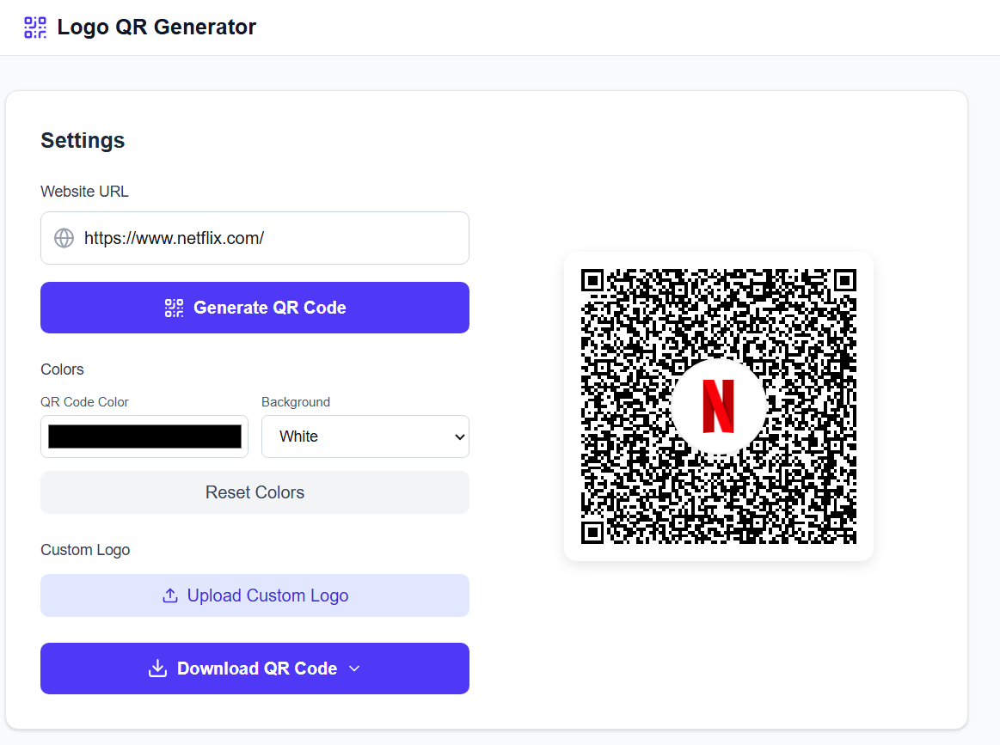

# QRCraft

[](https://nextjs.org/)
[](https://www.typescriptlang.org/)
[](https://tailwindcss.com/)
[](https://reactjs.org/)

> Create beautiful QR codes with automatic logo embedding from website favicons

QRCraft automatically fetches website favicons and embeds them as logos in the center of QR codes. Perfect for branding, marketing, and creating professional-looking QR codes with just a URL.

## Features

- **Automatic Favicon Detection** - Fetches and processes website favicons automatically
- **Custom Logo Upload** - Upload your own logos for personalized QR codes  
- **Perfect Center Alignment** - Logos are precisely positioned in QR code centers
- **Multiple Export Formats** - Download as PNG, JPEG, SVG, or WEBP
- **Color Customization** - Customize QR code and background colors
- **Logo Size Control** - Adjust logo size with an intuitive slider
- **Responsive Design** - Works perfectly on desktop and mobile devices
- **Fast Performance** - Built with Next.js for optimal speed

## Demo



**Try it live: [https://qrft.vercel.app]**

## Tech Stack

| Technology | Purpose |
|------------|---------|
|  | Full-stack React framework |
|  | Type-safe JavaScript |
|  | Utility-first CSS framework |
|  | UI library |

### Key Libraries

- **QR Code Generation**: `qrcode.react`, `qrcode`
- **Image Processing**: `html-to-image`, `downloadjs` 
- **Icons**: `lucide-react`
- **Styling**: `tailwindcss`, `postcss`

## Getting Started

### Prerequisites

- Node.js 18 or higher
- npm, yarn, pnpm, or bun

### Installation

1. Clone the repository
   ```bash
   git clone https://github.com/Blue-B/qrcraft.git
   cd qrcraft
   ```

2. Install dependencies
   ```bash
   npm install
   ```

3. Run the development server
   ```bash
   npm run dev
   ```

4. Open [http://localhost:3000](http://localhost:3000) in your browser

## Usage

1. **Enter a Website URL** - Paste any website URL into the input field
2. **Generate QR Code** - Click "Generate QR Code" to create your QR with auto-detected favicon
3. **Customize** (Optional):
   - Upload custom logo
   - Adjust logo size
   - Change colors
4. **Download** - Choose your preferred format (PNG, SVG, JPEG, WEBP)

## Project Structure

```
qrcraft/
├── src/
│   ├── app/
│   │   ├── api/
│   │   │   ├── favicon/route.ts    # Favicon fetching API
│   │   │   └── qrcode/route.ts     # QR generation API
│   │   ├── layout.tsx              # Root layout
│   │   ├── page.tsx                # Main QR generator page
│   │   └── globals.css             # Global styles
├── public/                         # Static assets
├── package.json
└── README.md
```

## API Reference

### GET /api/favicon

Fetches favicon from a given domain with multiple fallback sources.

**Query Parameters:**
- `domain_url` - The domain to fetch favicon from

**Response:** Image blob or error message

### GET /api/qrcode

Generates QR code from text input.

**Query Parameters:**
- `text` - Text to encode in QR code

**Response:** JSON with base64 QR code data

## Contributing

Contributions are welcome! Here's how you can help:

1. Fork the repository
2. Create a feature branch (`git checkout -b feature/amazing-feature`)
3. Commit your changes (`git commit -m 'Add amazing feature'`)
4. Push to the branch (`git push origin feature/amazing-feature`)
5. Open a Pull Request

### Development Guidelines

- Follow TypeScript best practices
- Use Tailwind CSS for styling
- Write clear commit messages
- Test your changes thoroughly

## Support the Project

If QRCraft helped you, consider supporting its development!

[](https://github.com/sponsors/Blue-B)
[](https://buymeacoffee.com/beckycode7h)

Your support helps maintain and improve QRCraft for everyone.

## License

This project is licensed under the MIT License - see the [LICENSE](LICENSE) file for details.

## Acknowledgments

- [Next.js](https://nextjs.org/) for the amazing framework
- [Tailwind CSS](https://tailwindcss.com/) for beautiful styling
- [Lucide](https://lucide.dev/) for clean icons
- [Vercel](https://vercel.com/) for hosting solutions

---

<div align="center">

**Made with ❤️ by [Blue-B](https://github.com/Blue-B)**

If you found this project helpful, please consider giving it a ⭐

</div>